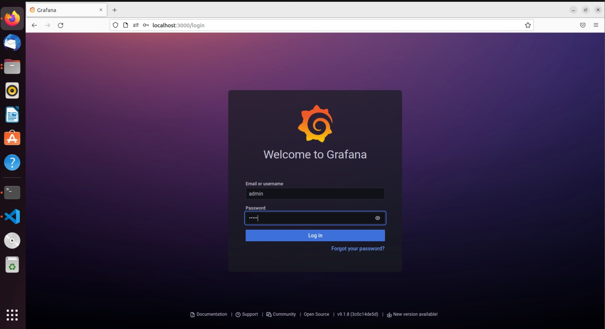
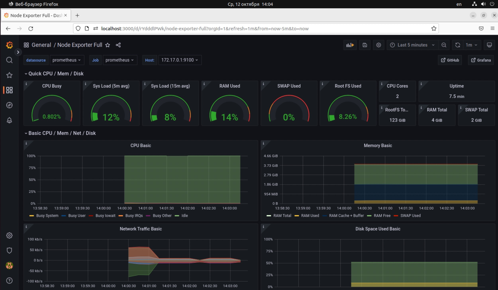

# Astra
Тестовое задание на вакансию DevOps в компанию AstraLinux


# Описание
1. После команды `vagrant up` запускает образ из бокса [generic/ubuntu2004](https://app.vagrantup.com/generic/) в виртуальной среде VirtualBox.
2. Образ конфигурируется посредством файла `Vagrantfile`. Меняется название виртуальной машины, кол-во оперативной памяти, настраивается динамическая адресация, пробрасывается 3000 порт с ВМ на хост машину, а также происходит обращение к плейбуку `myplaybook.yml`.
3. Посредством файла `myplaybook.yml` внутри виртуальной машины средствами Ansible происходит установака `docker`, `docker-compose`, `node-exporter`, создается директория для докера, в неё копируются файлы из папки `docker/`, а также происходит запуск контейнера `docker-compose`.
4. Посредством файла `docker-compose.yml` происходит запуск контейнеров `prometheus`, `grafana`.  
4.1. Первый контейнер с [Prometheus](https://prometheus.io/), настроен на сбор метрик с prometheus-node-exporter из Ubuntu.  
4.2. Второй контейнер с [Grafana](https://grafana.com/), настроен на использование в качестве datasource системы мониторинга prometheus из первого контейнера.  
5. В Grafana загружен [Node exporter full dashboard](https://grafana.com/grafana/dashboards/1860) (dashboard 1860), который визуализирует метрики полученные с `prometheus-node-exporter`.
6. Контейнер с grafana пробрасывает 3000 порт виртуальную машину ubuntu, а она в свою очередь в хостовую машину.
7. В конечном счёте, после всех настроек, на хост-машине по адресу `localhost:3000/`, будет доступен dashboard с метриками ВМ Ubuntu.
 >*ВАЖНО:* Для работы стенда необходима предустановка `vagrant`,`ansible` и `virtualbox`.

>*ВАЖНО:*  После запуска, vagrant попытается загрузить из сети бокс generic/ubuntu2004, но т.к. в данный момент скачивание по сети заблокировано, то бокс необходимо [скачать](https://app.vagrantup.com/generic/boxes/ubuntu2004/versions/4.1.16/providers/virtualbox.box) и добавить вручную из файла с помощью команды:  
>```shell 
>vagrant box add <имя_файла> --name generic/ubuntu2004
>```


После запуска необходимо дождаться завершения работы vagrant/ansible/docker-compose и перейти в браузере по адресу:
```shell
localhost:3000/
```

В браузере отобразится окно входа в web-интерфейс Grafana. 
Данные авторизации по умолчанию:

**login**:    admin  
**password**: admin




## Структура проекта
```shell
├── ansible
├── ubuntu2004.box
│   ├── docker
│   │   ├── docker-compose.yml
│   │   ├── grafana
│   │   │   ├── dashboards.yml
│   │   │   ├── datasources.yml
│   │   │   ├── DockerGraf
│   │   │   └── node-exporter-full.json 
│   │   └── prometheus
│   │       ├── DockerProm
│   │       └── prometheus.yml
│   └── myplaybook.yml
├── sourcelist.txt
└── Vagrantfile

### Описание файлов
***Vagrantfile***    ---  файл конфигурации vagrant
***ubuntu2004.box*** ---  vagrant-box, из которого создается виртуальная машина
***myplaybook.yml*** --- Файл, содержащий плейбуки
***docker-compose.yml*** --- Файл конфигурации docker-compose для запуска нескольких контейнеров
***sourcelist.txt*** --- Список использованных источников
В директориях grafana и prometheus содеражтся файлы конфигурации для контейнеров

4 directories, 11 files
